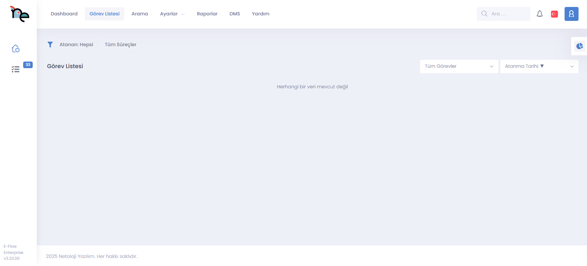
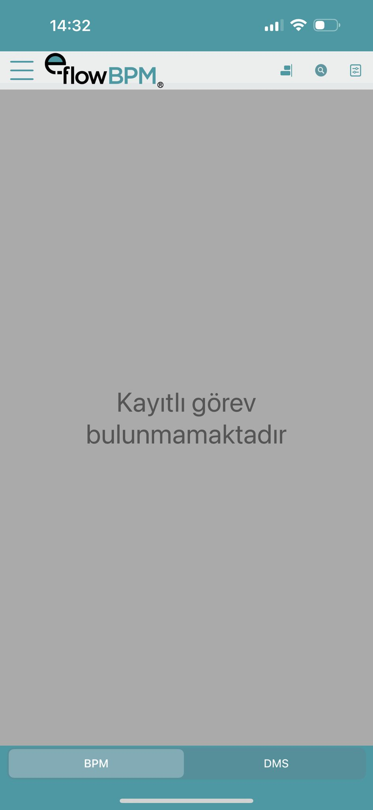

# E-Flow Nedir?

**E-Flow**, kurumların iç işleyişini dijitalleştirmek, izlenebilir hale getirmek ve verimli bir biçimde yönetmek amacıyla geliştirilmiş, kod gerektirmeden süreç tasarımı yapılabilen bir **İş Süreçleri Yönetim Sistemi (BPM)**’dir.  
Gelişmiş sürükle-bırak arayüzü sayesinde teknik bilgisi olmayan kullanıcılar bile kolayca iş akışlarını oluşturabilir ve süreçleri canlı sistemde çalıştırabilir.

---

## E-Flow Nasıl Çalışır?

### Süreç Tasarımı
Kullanıcılar süreç adımlarını, onay zincirlerini ve karar mekanizmalarını **E-Flow Designer** üzerinden tanımlar. Bu tasarım genellikle şu bileşenleri içerir:

- Başlangıç adımı  
- Görev atama  
- Onay / Reddetme adımları  
- Koşullu geçişler (ör. "Bütçe > 10.000 TL ise yöneticiden onay al")  
- E-posta bildirimleri  
- Veritabanı kayıtları  

### Form Yapısı
Her adımda kullanıcıların dolduracağı formlar tanımlanır. Bu formlar şunları içerebilir:

- Metin kutuları  
- Açılır menüler  
- Tarih seçiciler  
- Dosya yükleme alanları  

Formlar, süreç boyunca veri toplamak ve yönlendirmek için kullanılır.

### Rol Bazlı Dağıtım
Kimin hangi adımı göreceği veya dolduracağı roller aracılığıyla belirlenir.  
Bu da süreçleri kişiselleştirir ve kullanıcı bazlı filtreleme yapılmasını sağlar.

### Entegrasyon
**E-Flow**, şirketin mevcut sistemleri (ERP, CRM, HRM, SAP, SQL Server, Oracle vb.) ile web servisleri veya veri tabanı bağlantıları üzerinden entegre olabilir.  
Örnekler:

- Personel bilgisi SAP’den alınabilir.  
- Satın alma onayı sonrası ERP’ye otomatik kayıt geçilebilir.  

### Kurallar ve Otomasyon
Koşullara bağlı otomasyonlar oluşturulabilir. Örnekler:

- “Tutar > 50.000 TL ise CFO onayı gerek.”  
- “Formda ‘evet’ seçilirse ek alanları göster.”  

Bu yapı sayesinde süreçler sadece otomatik değil, akıllı ve dinamik hale gelir.

---

## E-Flow’un Modülleri ve Özellikleri

| **Modül / Özellik** | **Açıklama** |
|----------------------|---------------|
| **Designer** | Sürükle-bırak mantığıyla süreç tasarımı yapılır. |
| **Form Tasarımcısı** | Form alanları oluşturulur ve her adıma atanır. |
| **Görev Kutusu** | Kullanıcının yapması gereken işlemler burada listelenir. |
| **Bildirim Sistemi** | E-posta veya sistem içi bildirim gönderme özelliği. |
| **Mobil Uyum** | Süreçler mobil cihazlardan da yönetilebilir. |
| **Zamanlayıcı** | Süreçleri belli aralıklarla otomatik başlatma özelliği. |
| **Yetkilendirme Sistemi** | Roller ve izinler aracılığıyla kimin ne yapabileceği belirlenir. |
| **Raporlama ve Loglama** | Süreç ilerleme raporları, kişi bazlı istatistikler, işlem geçmişi. |
| **Doküman Yönetimi** | Dosya yükleme ve saklama yetenekleri. |

---

## E-Flow’un Faydaları

- **Verimlilik:** İşlerin otomatik ilerlemesiyle zaman tasarrufu sağlanır.  
- **İzlenebilirlik:** Kimin ne zaman ne yaptığı kaydedilir; denetim kolaylaşır.  
- **Uyumluluk:** İç denetim ve KVKK, ISO 9001 gibi standartlarla uyumlu süreçler oluşturulabilir.  
- **Geliştirilebilirlik:** İhtiyaca göre yeni süreçler tasarlanabilir, mevcut süreçler değiştirilebilir.  
- **Kullanıcı Dostu:** Teknik bilgilere ihtiyaç duymadan süreç hazırlanabilir.

---

## E-Flow Kullanım Senaryoları

- **İK Süreçleri:** İzin talepleri, avans başvuruları, işe giriş ve çıkış süreçleri  
- **Finans Süreçleri:** Fatura onayı, harcama onayları, bütçe talepleri  
- **Satın Alma Süreçleri:** Teklif toplama, sipariş onayları, tedarikçi değerlendirmesi  
- **IT Süreçleri:** Destek talepleri, donanım / yazılım istekleri  
- **Kalite Yönetimi:** Düzeltici faaliyetler, uygunsuzluk bildirimi, iç denetim raporları  

---

## Mobil ve Web Uyumlu

**E-Flow**, tüm modern tarayıcılarda çalışır.  
Mobil cihazlarla da süreç başlatmak, onaylamak veya gözlemlemek mümkündür.  
Bu, özellikle saha çalışanları veya seyahat eden yöneticiler için büyük avantaj sağlar.

---

## Sonuç

**E-Flow**, işletmenizin dijital dönüşüm sürecinde kilit rol oynayabilecek bir BPM platformudur.  
Süreçlerinizi şeffaf, yönetilebilir ve geliştirilebilir hale getirerek zaman ve kaynak tasarrufu sağlar.
